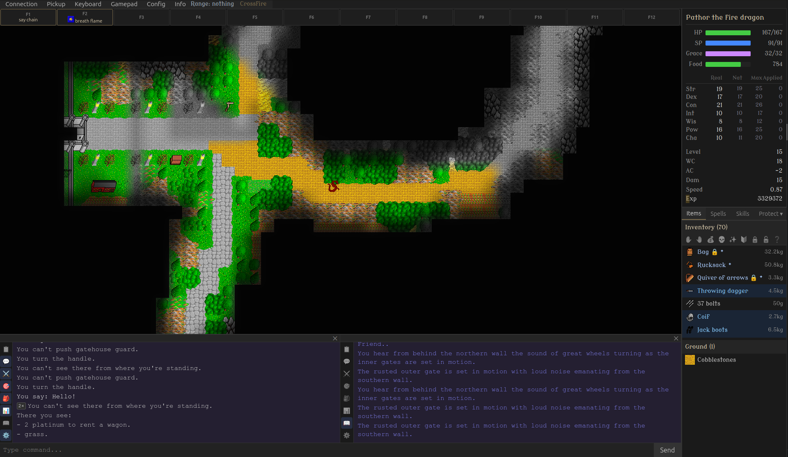

# Crossfire Web Client

This is a conversion of the [Crossfire](https://crossfire.real-time.com/) GTK-v2 client to TypeScript and
[Svelte](https://svelte.dev/).

[Vite](https://vite.dev/) is used for the building everything.

Almost everything was done by GitHub Copilot with Claude Opus or Sonnet,
and me just testing the different versions.

There is a test server at __crossfire diegeekdie com__. It is just for
testing and can go down at any time.



## Connecting to a specific server

Append a `?server=` query parameter to the page URL to pre-fill (and
automatically initiate) the connection to a particular server, e.g.:

```
https://example.com/?server=wss://crossfire.example.com/ws
```

When this parameter is present the server-address input field is hidden and
the client connects automatically, bypassing the manual "Enter" step.

## Protocol changes

Web pages can't use raw TCP sockets so WebSockets has to be used.

The public crossfire clients don't support WebSockets, so a WebSocket
proxy has to be used when connecting to them. There is one included in
the repo that also handles crossfire's protocol's length header.

The [crossfire-server](https://github.com/bofh69/crossfire-server) fork
has built in support for WebSockets.

## UX differences compared to GTK client.

The client doesn't contact a metaserver as the normal servers
don't use support WebSockets anyway.

I prefer the old login system of logging in to the character
directly, so that's what the client does.

A web page can't override all the browser's built in hot keys,
so alt is used instead of ctrl for running. That way it hopefully
leads to fewer conflicts with the browser.

There is a "Keyboard" menu for handling key bindings.

Key bindings are stored locally in the browser. If playing
from different computers/browsers, the bindings will have to
be redone.

Left clicking on items activates them.

Right clicking on items and skills brings up a menu.

Left clicking on a spell selects it.

Right clicking on skills brings up a menu for use/ready of it.

## Music & sfx

The client supports music and sfx, they are downloaded
as needed from the server. Both can be muted.

## Gamepad support

There is simple gamepad support built in. Currently it only has default
bindings for my XBox One controller.

It is possible to configure the client for more controllers, but it
takes some time. It is probably easier to change in the code instead.

PRs for more controllers are welcome.
